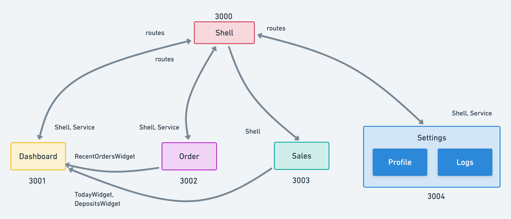

# Shared App Shell, State, Routing and Components Example

This example demos a basic host application loading remote component.

- `shell` is the App Shell
- `dashboard` - standalone application
- `order` - standalone application
- `sales` - standalone application
- `settings` - standalone application

# Running Demo

- `npm install`
- `npm run start`

This will build all the apps `shell`, `dashboard`, `order`, `profile`, `sales` on different ports as shown below

- [localhost:3000](http://localhost:3000/) (HOST) - `shell`
- [localhost:3001](http://localhost:3001/) (STANDALONE REMOTE) - `dashboard`
- [localhost:3002](http://localhost:3002/) (STANDALONE REMOTE) - `order`
- [localhost:3003](http://localhost:3003/) (STANDALONE REMOTE) - `sales`
- [localhost:3004](http://localhost:3004/) (STANDALONE REMOTE) - `settings`

You will notice that each of the above URLs will look exactly same. For more details [Watch this YouTube video](https://www.youtube.com/watch?v=-LNcpralkjM)
